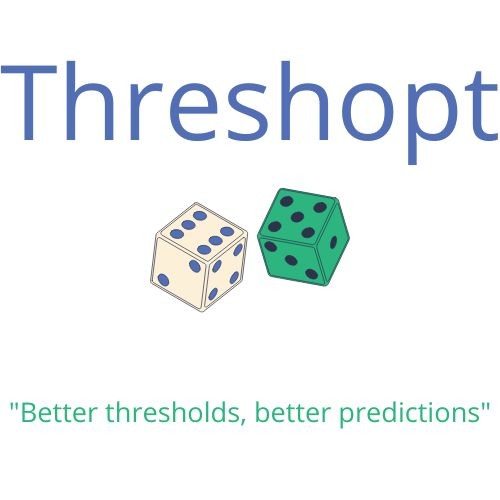

[](https://pypi.org/project/threshopt/)
[](https://www.apache.org/licenses/LICENSE-2.0)


**Threshold Optimization Library for Binary and Multiclass Classification**

`threshopt` is a lightweight Python library to find the optimal decision threshold for classifiers, improving performance by customizing thresholds instead of relying on defaults.

---

## Features

- Optimize decision thresholds based on any metric (e.g., accuracy, F1-score, G-Mean, Youden’s J)
- Supports cross-validation threshold optimization
- Works with any scikit-learn compatible model
- Built-in common metrics and support for custom metrics
- Optional visualization of confusion matrices and prediction score distributions
- Multiclass and fallback support

---

## Installation

```bash
pip install threshopt
```

## Quickstart

### Binary classification

```python
from threshopt import optimize_threshold, optimize_threshold_cv, gmean_score
from sklearn.ensemble import RandomForestClassifier
from sklearn.datasets import load_breast_cancer
from sklearn.metrics import f1_score

# Load data
data = load_breast_cancer()
X, y = data.data, data.target

# Train model
model = RandomForestClassifier(random_state=42)
model.fit(X, y)

# Optimize threshold on the test set
best_thresh, best_val = optimize_threshold(model, X, y, metric=f1_score)
print(f"Best threshold: {best_thresh:.2f}, F1-score: {best_val:.4f}")

# Optimize threshold with cross-validation
best_thresh_cv, best_val_cv = optimize_threshold_cv(model, X, y, metric=gmean_score, cv=5)
print(f"CV best threshold: {best_thresh_cv:.2f}, CV best metric: {best_val_cv:.4f}")
```

### Multiclass classification

```python
from threshopt import optimize_threshold, optimize_threshold_cv, gmean_score
from sklearn.ensemble import RandomForestClassifier
from sklearn.datasets import load_iris
from sklearn.metrics import f1_score

# Load data
data = load_iris()
X, y = data.data, data.target

# Train model
model = RandomForestClassifier(random_state=42)
model.fit(X, y)

# Optimize threshold for multiclass using fallback
best_thresh, best_val = optimize_threshold(model, X, y, metric=f1_score, multiclass=True)
print(f"Best thresholds per class: {best_thresh}, F1-score: {best_val:.4f}")

# Optimize threshold with cross-validation
best_thresh_cv, best_val_cv = optimize_threshold_cv(model, X, y, metric=gmean_score, cv=5, multiclass=True)
print(f"CV best thresholds per class: {best_thresh_cv}, CV best metric: {best_val_cv:.4f}")
```

## Metrics

Included metrics:

-   `gmean_score`: Geometric Mean of sensitivity and specificity
-   `youden_j_stat`: Youden’s J statistic (sensitivity + specificity - 1)
-   `balanced_acc_score`: Balanced Accuracy (wrapper around scikit-learn)

You can also pass any metric function with signature `metric(y_true, y_pred)`.

------------------------------------------------------------------------

## Contributing

Contributions are welcome! Please open issues or submit pull requests.

------------------------------------------------------------------------

## License

This project is licensed under the Apache License 2.0 - see the [LICENSE](LICENSE) file for details.
